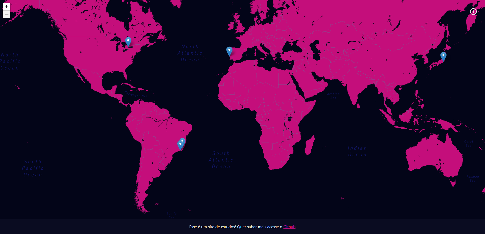

<h1 align="center">
My Trips
</h1>

<p align="center">

  

  

  <a href="https://www.linkedin.com/in/alquiponeto/">
      
  </a>

  <a href="https://github.com/Alquipo/my-trips/commits/master">
      
  </a>


  


  <a href="https://github.com/Alquipo/my-trips/actions/workflows/ci.yml">
    
  </a>
</p>


<p align="center">

  <a target="_blank" href="https://reactjs.org/">
    
  </a>

  <a target="_blank" href="https://nextjs.org/">
      
  </a>
</p>

<h2 align="center">
  Bem Vindo ao App My Trips
</h2>

## 🚀 Sobre o Projeto

My Trips e uma aplicação para incentivar quem viaja muito a registrar fotos e informações das viagens, tudo usando React e GraphCMS para adicionar os dados.

## 🎨 Layout

<h4 align="center">
  
</h4>

## 🔨 Tecnologias:

- **[TypeScript](https://www.typescriptlang.org/)**
- **[NextJS](https://nextjs.org/)**
- **[Styled Components](https://styled-components.com/)**
- **[Jest](https://jestjs.io/)**
- **[React Testing Library](https://testing-library.com/docs/react-testing-library/intro)**
- **[Eslint](https://eslint.org/)**
- **[Prettier](https://prettier.io/)**
- **[Husky](https://github.com/typicode/husky)**
- **[PlopJS](https://plopjs.com/)**
- **[GraphQL](https://graphql.org/)**
- **[GraphCMS](https://graphcms.com/)**
- **[Leaflet](https://leafletjs.com/)**
- **[MapBox](https://www.mapbox.com/)**

## 🔎 Comandos

- `dev`: Executa a aplicação em `localhost:3000`
- `build`: Cria a Build do projeto
- `start`: Inicia um servidor simples com o código de produção
- `lint`: Executa o **Linter** em todos os componentes e páginas
- `test`: Executa **Jest** para testar todos os componentes e páginas
- `test:watch`: Executa **Jest** em watch mode
- `codegen`: Cria as tipagens das query do GraphQL

## 🚀 Como rodar este projeto

Para clonar e executar este aplicativo, você precisará de [Git](https://git-scm.com) e [NodeJs](https://nodejs.org/en/) Instalado em seu computador.

### 🌀 Clonando o repositório

```bash
# Clone este repositório
$ git clone https://github.com/Alquipo/my-trips

# Acesse a pasta do projeto no terminal/cmd
$ cd my-trips
```

### 🎲 Rodando a Aplicação

```bash
# Instale as dependências
$ yarn install

# Execute a Aplicação em Desenvolvimento
$ yarn dev

# O servidor inciará na porta:3000 - acesse http://localhost:3000

```
### 📁 Configuração .ENV

```bash
#adicionado .env.example no projeto, lembrar de adicionar as variáveis de ambiente conforme o exemplo

#GRAPHCMS
GRAPHQL_HOST=
GRAPHQL_TOKEN=

#MAPBOX
NEXT_PUBLIC_MAPBOX_API_KEY=
NEXT_PUBLIC_MAPBOX_USERID=
NEXT_PUBLIC_MAPBOX_STYLEID=

#Google Analytics
NEXT_PUBLIC_GA_TRACKING=

```

## 🤔 Como contribuir para o projeto

- Faça um **fork** do projeto;
- Crie uma nova branch com as suas alterações: `git checkout -b my-feature`
- Salve as alterações e crie uma mensagem de commit contando o que você fez:`git commit -m "feature: My new feature"`
- Envie as suas alterações: `git push origin my-feature`

> Caso tenha alguma dúvida confira este [guia de como contribuir no GitHub](https://github.com/firstcontributions/first-contributions)

## 📝 Licença

Este projeto esta sobe a licença MIT. Veja a [LICENÇA](https://opensource.org/licenses/MIT) para saber mais.

Feito com ❤️ por Alquipo Neto 👋🏽 [Entre em contato!](https://www.linkedin.com/in/alquiponeto/)

</h3>
